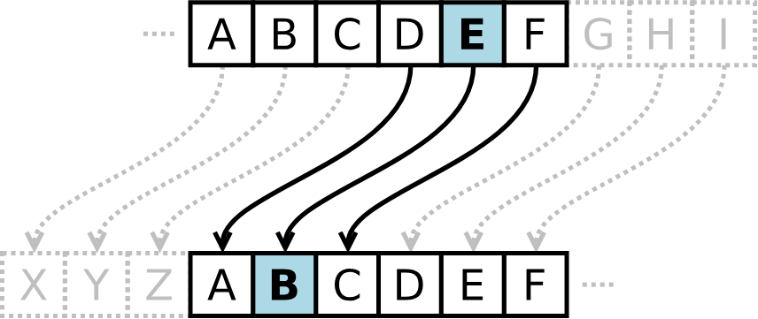
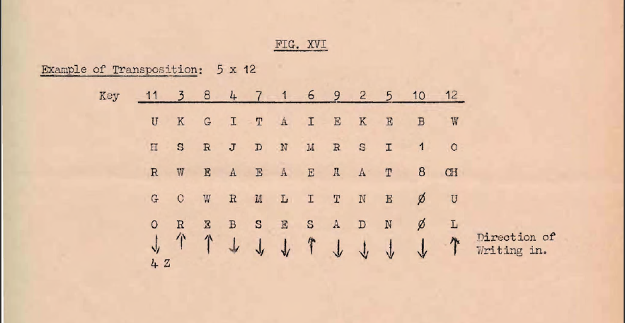
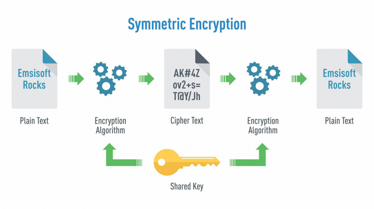

# Introduction to Cryptography

## Intro

What we'll see:

- Symmetric and asymmetric encryption
- Diffie-Hellman Key Exchange
- Hashing
- PKI

What would you need to send a secret message?: **A cipher!**

### Substitution Cipher

**Caesar Cipher:** This is one example of a **substitution cipher**. You can "rotate" the position of the letters of the message between 1 and 25 times (0 means no change and 26 would take you back to the first letter). The amount of rotations is the key.



*Source: https://commons.wikimedia.org/wiki/File:Symmetric_encryption.png*

**Mono-Alphabetic Substitution Cipher:**

We assign each letter of the alphabet another letter. The result is something like the image bellow. Bruteforcing a message ciphered this way would take a long time, but not long enough (like a week, so its not secure, anyway, you might want to google that).


*Figure: “Substitution cipher” by Meilani.conley, via Wikimedia Commons, licensed under CC BY-SA 4.0.

Source: https://commons.wikimedia.org/wiki/File:Substitution_cipher.PNG
License: https://creativecommons.org/licenses/by-sa/4.0/  
Changes: none.*

### Transposition Cipher

We can encrypt the message my putting it into a matrix. We give a value to each column and them scramble them. The scrambled column order is the key and the text is ciphered.



*Source: https://commons.wikimedia.org/wiki/File:4-Letter_Transposition_cipher_Fig_XVI.png*

However, these are problems that can be solved in polynomial time. They are not hard enough and can be bruteforced.

"If the encrypted message can be broken in one week, the encryption used would be considered insecure. However, if the encrypted message can be broken in 1 million years, the encryption would be considered practically secure."

[quipqiup](https://www.quipqiup.com/) allows us to easily solve Mono-alphabetic substitution ciphers.

## Symmetric Encryption

### Encryption Terminology

- **Cryptographic Algorithm or Cipher**: Defines the encryption and decryption process
- **Key**: Used by the cryptographic algorithm to convert plaintext into ciphertext and vice versa
- **Plaintext**: Original message
- **Ciphertext**: Encrypted message

Symmetric encryption uses the same key for encryption and decryption.
So a sends something to b using the key to encrypt. b uses the same key to decrypt and see the message.



*Figure: “Symmetric encryption” by Munkhzaya Ganbold, via Wikimedia Commons, licensed under CC BY-SA 4.0.  
Source: https://commons.wikimedia.org/wiki/File:Symmetric_encryption.png  
License: https://creativecommons.org/licenses/by-sa/4.0/  
Changes: none.*


---

### AES

Advanced Encryption Standard uses a key size of 128, 192, or 256 bits. It is still considered secure, unlike DES (Data Encryption Standard). AES repeats the following four transformations multiple times:

1. SubBytes(state)
2. ShiftRows(state)
3. MixColumns(state)
4. AddRoundKey(state)

[This video](https://www.youtube.com/watch?v=C4ATDMIz5wc) does a great job demonstrating how AES works.

AES is a **block cipher algorithm**, which converts the input (plaintext) into blocks and encrypts each block.

The other type of symmetric encryption algorithm is **stream ciphers**, which encrypt the plaintext byte by byte.

---

✅ Symmetric encryption solves many sec. issues:

- Confidentiality: for obvious reasons...
- Integrity: Changes to the ciphertext would prevent decryption or would lead to a gibberish plaintext
- Authenticity: Only those who know the secret key can decrypt the message

❎  However:

Symmetric Encryption is not scalable: With two people we need 1 key. With 100 people we need 5000. The ratio is:

$$
K=\binom{n}{2}=\frac{n(n-1)}{2}
$$

- If a system gets compromised, all of their keys have to be recreated
- A secure chanel has to be found to exchange keys (in this case, many keys)

All of this is solved by **Asymmetric Encryption**.

### Symmetric Encryption in the Terminal

#### GNU Privacy Guard (GPG)

Check supported ciphers:

```bash
gpg --version
```

Encrypt (replace CIPHER with encryption algorithm):

```bash
gpg --symmetric --cipher-algo CIPHER message.txt
```

The result is saved as message.txt.gpg.

Decrypt:

```bash
gpg --output original_message.txt --decrypt message.gpg
```

#### OpenSSL Project

Encrypt:

```bash
openssl aes-256-cbc -e -in message.txt -out encrypted_message
```

Decrypt:

```bash
openssl aes-256-cbc -d -in encrypted_message -out original_message.txt
```

Encryption + Password-Based Key Derivation Function 2 (PBKDF2) and iterations on the password:

```bash
openssl aes-256-cbc -pbkdf2 -iter 10000 -e -in message.txt -out encrypted_message
```

Decryption:

```bash
openssl aes-256-cbc -pbkdf2 -iter 10000 -d -in encrypted_message -out original_message.txt
```

## Asymmetric Encryption

No need to find a secure channel through asymmetric encryption because we have two keys:

- One is public, you can share it with anyone.
- Another is private, only you should know it.

With your public key anyone can encrypt the message but only the private key holder can decrypt it.
Conversely, a private key can be used to encrypt something and any holder of the public key can decrypt it.

It is not mathematically feasible to get the private key through the public one!
So, we only need to make the channel reliable (to protect integrity, not confidentiality).

Aside from Confidentiality, Asymmetric Encryption aids:

- Integrity: If the message, encrypted through the private key, is successfully decrypted through the public key, the message was not altered across the way.
- Authenticity: Since no one else has access to the private key, the message must come from the private key owner.
- Nonrepudiation: For the same reason, they cannot deny sending this message.

### RSA

If you **really** want to know the math behind the RSA asymmetric encryption algorithm watch these two:

- [RSA: Computing an Example](https://youtu.be/4zahvcJ9glg?si=Kg_BA-OZtEGM0AB_)
- [RSA: Generating the keys](https://youtu.be/oOcTVTpUsPQ?si=zLjiRQd5CGzLOZVA)

The security of RSA relies on the difficulty of factoring large numbers $(N)$ into their two prime components ($p$ and $q$). While multiplication $(p×q=N)$ is easy, reversing it is extremely hard. For security, p and q must be very large (e.g., 1024 bits each, over 300 digits). The system also critically depends on using secure random numbers to generate $p$ and $q$; if an attacker can guess these primes, the security fails.

### Asymmetric Encryption in the Terminal

Generate the private key using openSSL:

```bash
openssl genrsa -out private-key.pem 2048
```

Get the public key component from the private:

```bash
openssl rsa -in private-key.pem -pubout -out public-key.pem
```

See the real RSA variables ($p$, $q$, $N$, $e$ and $d$):

```bash
openssl rsa -in private-key.pem -text -noout
```

Encrypt using the rsa public key:

```bash
openssl pkeyutl -encrypt -in plaintext.txt -out ciphertext -inkey public-key.pem -pubin
```

Decrypt using the private key:

```bash
openssl pkeyutl -decrypt -in ciphertext -inkey private-key.pem -out decrypted.txt
```

## Diffie-Hellman Key Exchange

Diffie-Hellman is an method for securely generating a symmetric key over a public channel.

[I recommend this video](https://www.youtube.com/watch?v=85oMrKd8afY&t=1s) for understanding how Diffie-Hellman works.

### Diffie-Hellman in the Terminal

Generate Diffie-Hellman parameters:

```bash
openssl dhparam -out dhparams.pem 2048
```

See the $P$ and $G$ parameters generated:

```bash
openssl dhparam -in dhparams.pem -text -noout
```

## Hashing

Algorithm that takes data of arbitrary size and returns a **fixed size value** (regardless of file size), called a *message digest* or *checksum*.

```sha256sum``` Returns a checksum of 256 bits (32 bytes or 64 hex characters).

Hashing is useful for:

- storing passwords: We can store hashes instead of passwords. It is not mathematically feasible to get a password from a hash.
- detecting modifications: Any (even a single bit) modification to the plaintext produces a completely different hash.

These hashes are still considered secured:

- SHA224, SHA256, SHA384
- RIPEMD160

These hashes are cryptographically broken:

- MD5, SHA-1

### HMAC

[This video](https://www.youtube.com/watch?v=fzMIjWFYQl0) does a good job explaining what is MAC and HMAC and why do we need them.
The main point is that *just hashing isn't enough*. That is where MAC (a message authentication code) comes handy. HMAC (Hash-based message authentication code) is MAC but defines a standard (or agreement) on how to use the message authentication code.

### HMAC in the Terminal

```bash
hmac256 s!Kr37 message.txt
```

```bash
sha256hmac message.txt --key s!Kr37
```

## PKI and SSL/TLS

Diffie-Hellman is still vulnerable to Man-In-the-Middle attacks. This is a problem of **authentication**:

"The reason is that Alice has no way of ensuring that she is communicating with Bob, and Bob has no way of ensuring that he is communicating with Alice when exchanging the secret key.".

This susceptibility necessitates some mechanism that would allow us to confirm the other party’s identity (**authentication**) while assuring the **authenticity** of these IDs. This brings us to Public Key Infrastructure (PKI) and Transport Layer Security (TLS).

### PKI

PKI refers to "tools used to create and manage public keys for encryption, which is a common method of securing data transfers on the internet. PKI is built into all web browsers used today".

PKI works through the implementation of two technologies:

1. Certificates:  Documents emitted by Certificate Authorities (CA) that grant an entity permission to engage in the exchange of PKI keys (includes the public key).
2. keys (public and private).

A certificate needs to be signed in order to become a **valid signed certificate** (we can prove its authenticity).

**To generate a certificate** a Certificate Signing Request (CSR) must be send. The CA builds a **certificate** from it: a data package that serves as a "digital ID" with your name, your public key, the key expiration date and the CA's name, for example.  

**To generate a signed certificate** the original certificate is hashed and then encrypted with the private key of the CA. The encrypted hash is then appended to the original certificate.

Within the TLS handshake, if the client trusts the third party (the CA) the client will hash the certificate and then (using the public key of the CA) decrypt its attached signature. This process results in two hashes. By comparing these two hashes, the client confirms that the certificate is authentic and has not been altered, because only the trusted CA's private key could have created a signature that matches the certificate's data.

### SSL/TLS

TLS is a security protocol that allows application and servers to send data in an encrypted form. You can view TLS as a protocol that works on top of transport protocols (TCP and UDP) allowing things like HTTPS, SSH and NTP.

SSL is older than TLS, but served the same purpose. It is now deprecated.

TLS is what *actually* uses the certificates within the TLS Handshake.

The whole purpose of the TLS handshake is to establish *secure communication*. To do this the certificate must be verified by the client with the corresponding CA and must start the process to exchange keys (this process varies in each version, new versions seem to prefer Diffie-Helman to exchange keys without sharing them).


*Source: https://commons.wikimedia.org/wiki/File:Full_TLS_1.2_Handshake.svg*

[This video](https://www.youtube.com/watch?v=j9QmMEWmcfo&t=66s) explains SSL/TLS.

### SSL/TLS in the Terminal

**Generate a Certificate Signing Request (CSR)**:

```bash
openssl req -new -nodes -newkey rsa:4096 -keyout key.pem -out cert.csr
```

- `req -new` create a new CSR
- `-nodes` save private key without a passphrase
- `-newkey` generate a new private key
- `rsa:4096` generate an RSA key of size 4096 bits
- `-keyout` specify where to save the key
- `-out` save the certificate signing request

This command prompts you to answer a series of questions.

The CSR has to then be send to a CA to get signed.

**Generate a self signed certificate**:

```bash
openssl req -x509 -newkey -nodes rsa:4096 -keyout key.pem -out cert.pem -sha256 -days 365
```

- `-x509` indicates that we want to generate a self-signed certificate instead of a certificate request
- `-sha256` specifies the use of the SHA-256 digest valid for `-days 365`.

**Check self signed certificate**:

```bash
openssl x509 -in cert.pem -text
```

## Authenticating With Passwords

> [This video basically explains everything here](https://www.youtube.com/watch?v=--tnZMuoK3E)

Hash can be used to store passwords for authentication *without* actually storing them. When the user enters their password at logging it is hashed, and the result is send and compared to the hash in the database.

This table:

| Username | Password |
| - | - |
| Juan | querty |
| Bob | dragon |

Would rather be:

| Username | Password Hash |
| - | - |
| Juan | d8578edf8458ce06fbc5bb76a58c5ca4 |
| Bob | 8621ffdbc5698829397d97767ac13db3 |

This protects data in the case of a database leakage. However, **rainbow tables** render this approach **insecure**. Rainbow tables store precomputed hashes, with their respective pre-digest values.

One handy example is [CrackStation](https://crackstation.net/). This page allows you to enter a hash digest and get its pre-digest value.

### Salt

To fight against rainbow tables, a random value can be appended to the password before hashing it. This value is called **salt**.

| Username | Password Hash | Salt |
| - | - | - |
| Juan | 8a43db01d06107fcad32f0bcfa651f2f | 12742 |
| Bob | aab2b680e6a1cb43c79180b3d1a38beb | 22861 |

Even if the hashes are leaked, they do not have a direct relation to the original password. .

> Note that for this procedure to be *really* secure the hashing algorithm employed needs to be a trusted one (SHA256m for example) and the salt used for hashing would also need to be really long.

### PBKDF2 (Password-Based Key Derivation Function 2)

Key Derivation Functions take the password and the salt and submits it through a certain number of iterations, usually hundreds of thousands. This adds even more security.

> [Password Storage Cheat Sheet](https://cheatsheetseries.owasp.org/cheatsheets/Password_Storage_Cheat_Sheet.html) 